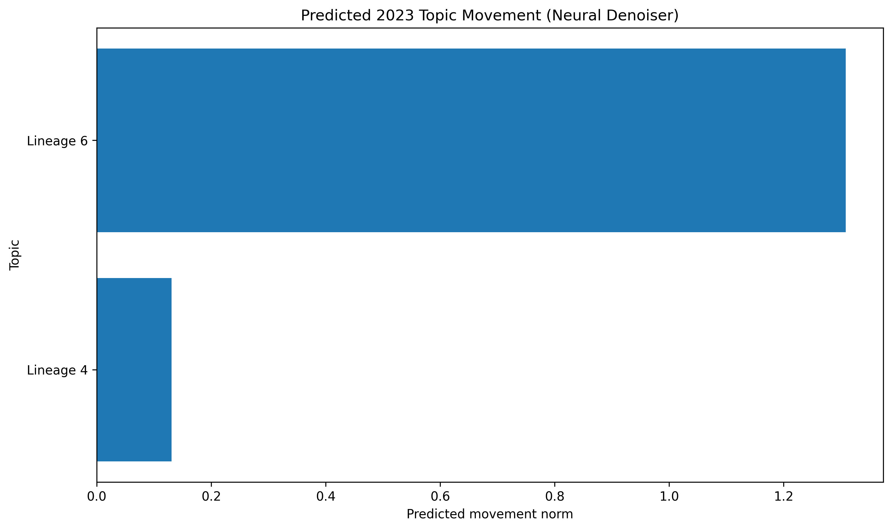
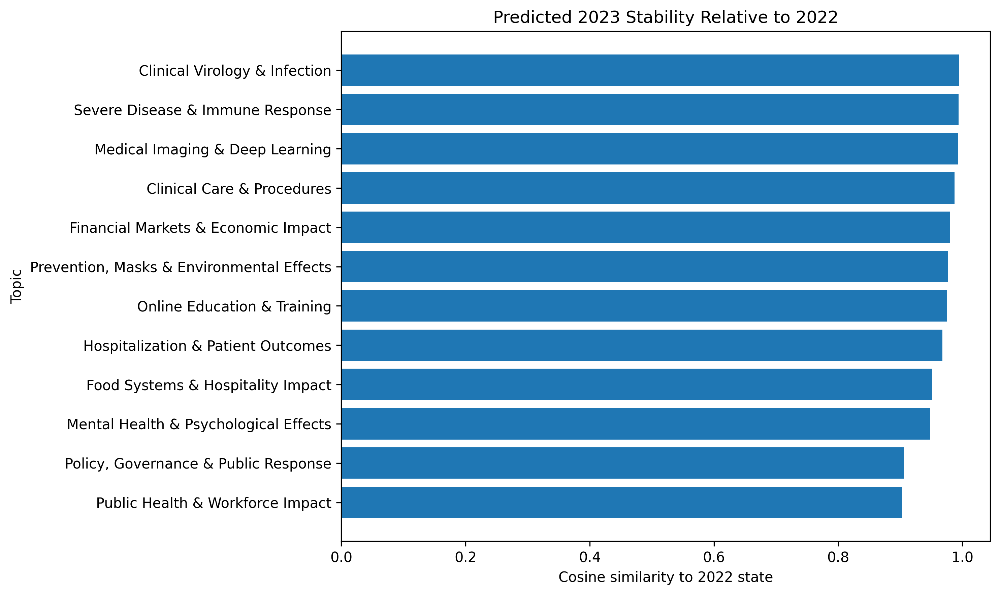
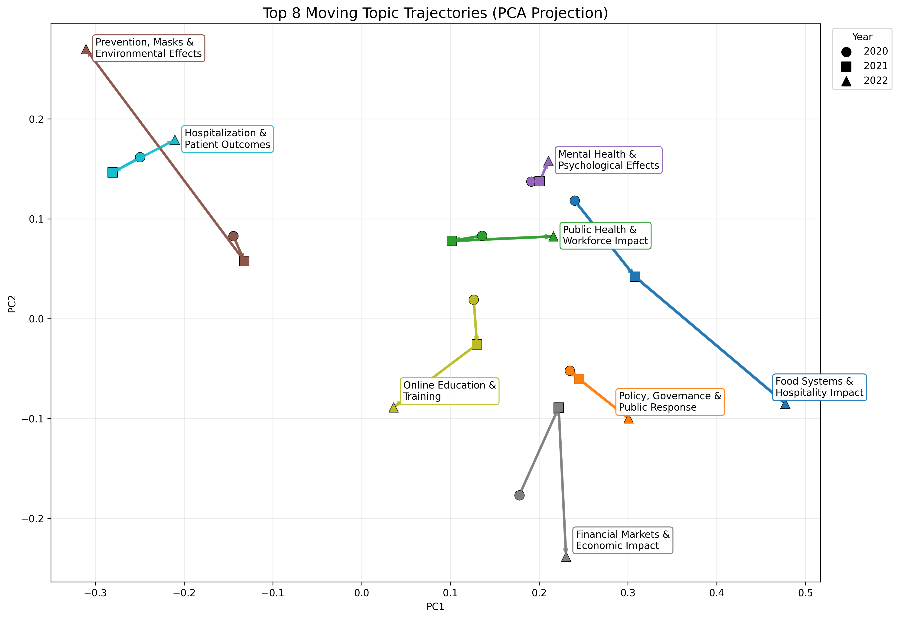
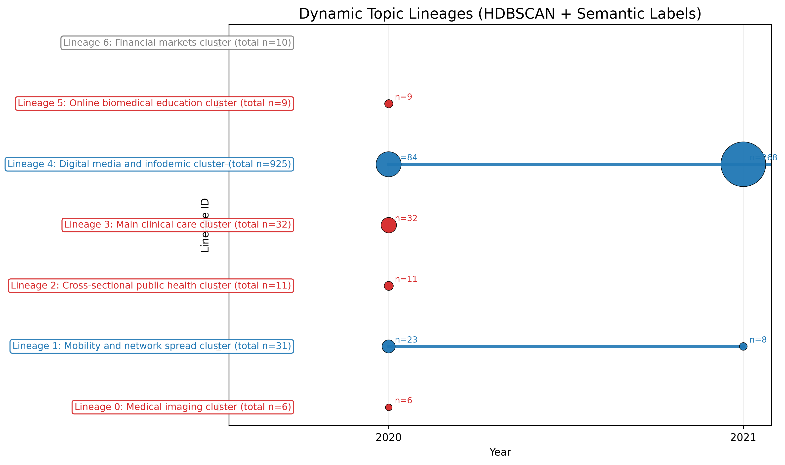

# Diffusion-Based Topic Evolution in Biomedical Literature

This project models how biomedical research topics evolve over time by combining topic discovery, clustering, and geometric trajectory modeling in embedding space.

Rather than fixing a static set of topics, the workflow extracts topic representations from biomedical abstracts grouped by time period, aligns related topics across years, and analyzes their evolution using:

- geometric trajectories in embedding space (PCA)
- structural lineage tracking (HDBSCAN clusters)
- diffusion-based modeling of topic dynamics

This enables analysis of:
- topic persistence  
- topic emergence and disappearance  
- semantic drift over time  
- relative movement magnitude across topics  

---

## Key Outputs

### Topic Movement Distribution


Distribution of topic movement magnitudes across time.

---

### Cosine Similarity Diagnostics


Measures how well topics align across adjacent years.

---

### PCA Topic Trajectories (Top 8 Movers)


Tracks semantic drift of the most dynamic topics in embedding space.

Encodes:
- direction of movement  
- magnitude (line thickness)  
- temporal progression  

---

### HDBSCAN Lineage Structure


Tracks how clusters evolve across time.

Encodes:
- persistence vs birth/death  
- document volume (node size)  
- semantic lineage labels  

---

## Current Pipeline

1. collect biomedical abstracts with publication dates  
2. preprocess and store documents in SQLite  
3. compute document embeddings (sentence-transformers)  
4. cluster documents per year using HDBSCAN  
5. represent clusters via embedding centroids  
6. align clusters across years into trajectories  
7. compute topic movement metrics  
8. model trajectory evolution using diffusion models (PyTorch)  
9. visualize trajectories and lineage dynamics  

---

## Core Idea

This project uses two complementary views of topic evolution:

### 1. Geometric Evolution (Embedding Space)
Topics are embedded in a continuous space and tracked over time using PCA.

→ captures semantic drift

### 2. Structural Evolution (Lineages)
Clusters are tracked as discrete entities across time using HDBSCAN.

→ captures birth, persistence, and disappearance

---

Together:

> Topic evolution = continuous semantic motion + discrete structural change

---

## Diffusion Modeling

A diffusion model is trained on topic embedding trajectories to learn the stochastic dynamics of topic evolution.

This enables:
- modeling uncertainty in topic movement  
- generating plausible future topic trajectories  
- capturing nonlinear evolution patterns beyond deterministic alignment  

Current implementation focuses on learning trajectory distributions; integration into forecasting and visualization is ongoing.

---

## Project Goals

- build a biomedical literature pipeline (PubMed / CORD-19 / curated datasets)  
- extract time-aware topic representations  
- align topics across years into trajectories  
- quantify topic movement and stability  
- model topic evolution using diffusion models  
- forecast future topic states  
- build an interactive dashboard  

---

## Next Steps

- improve diffusion model calibration and training stability  
- generate and visualize sampled future topic trajectories  
- integrate diffusion outputs into PCA and lineage plots  
- add uncertainty quantification to topic forecasts  
- scale to longer time horizons (e.g., 2012–2022)  
- build an interactive dashboard (Plotly / Dash)  

---

## Tech Stack

- Python  
- Jupyter notebooks  
- SQLite  
- pandas / numpy  
- scikit-learn  
- sentence-transformers  
- matplotlib / plotly  
- PyTorch 

Planned:
- Dash / Streamlit  
- MLflow  

---

## Repository Structure

```text
diffusion-topic-evolution/
├── README.md
├── requirements.txt
├── data/
├── db/
│   └── app.db
├── notebooks/
│   ├── 01_data_ingestion.ipynb
│   ├── 02_embedding_pipeline.ipynb
│   ├── 03_topic_discovery.ipynb
│   ├── 04_topic_dynamics.ipynb
│   ├── 05_diffusion_topic_simulation.ipynb
│   ├── 06_diffusion_denoising_model.ipynb
│   ├── 07_bnp_dynamic_topics.ipynb
│   └── 08_topic_visualization.ipynb
├── outputs/
│   ├── cosine_sim_latest.png
│   ├── linneage.png
│   ├── movement_norm.png
│   ├── top8_pca.png
├── src/
├── scripts/
├── dashboards/
└── docs/
```
---

## Notes

- notebook-first workflow for rapid experimentation  
- stable components will be migrated into `src/`  
- visualizations designed for both analysis and presentation  
- framework generalizes beyond biomedical literature  

---

## Summary

This project builds a system for modeling topic evolution as a dynamic process in embedding space, combining:

- clustering (HDBSCAN)  
- temporal alignment  
- trajectory analysis  
- lineage modeling  
- diffusion-based generative modeling  

and sets the foundation for:

> probabilistic forecasting of topic evolution

## Key Insights from 2020 COVID Data

The early COVID-19 literature exhibits a highly concentrated thematic structure, with a small number of dominant clusters accounting for a large share of publications. In particular, large persistent lineages such as *Clinical Care & Patients* and *Public Health & Workforce Impact* (as identified through HDBSCAN clustering and lineage tracking) span multiple years and contain the highest document counts. These clusters reflect core areas of sustained research focus, including hospital care, patient outcomes, and system-level public health responses, and remain stable across both structural (lineage) and alignment analyses.

In contrast, several smaller clusters exhibit clear birth-and-death dynamics, appearing in 2020 but failing to persist into subsequent years. For example, clusters related to *Digital Data & Infodemic Analysis* (e.g., Twitter-based studies) and *Network Spread & Mobility Modeling* show limited persistence and are classified as short-lived lineages. Similarly, niche clusters such as *Cross-sectional Health Surveys* and certain *Engineering/Biomedical Tools* topics either emerge briefly or reappear inconsistently, indicating fragmentation or insufficient density for stable alignment. These patterns suggest that much of the early literature contains exploratory or rapidly shifting subtopics that do not consolidate into long-term research directions.

The PCA trajectory analysis of the top-moving topics further reveals that semantic drift varies significantly across domains. Topics such as *Public Health & Workforce Impact* and *Financial Markets & Economic Impact* exhibit relatively large movement norms, indicating substantial shifts in focus or terminology over time. In contrast, clusters like *Clinical Virology & Infection* and *Medical Imaging & Deep Learning* show minimal movement and near-linear trajectories, reflecting semantic stability. This heterogeneity is also evident in the movement norm distribution, where a small subset of topics dominates the upper tail of movement magnitudes.

Alignment diagnostics based on cosine similarity reinforce these findings. Large, persistent clusters—such as the main clinical and public health lineages—show high cosine similarity across years, indicating strong continuity. Meanwhile, smaller clusters display weaker alignment scores, often falling into “weak match” categories or failing to align altogether. This suggests that topic continuity is strongly size-dependent: larger clusters maintain coherence, while smaller clusters are more susceptible to fragmentation or reorganization.

A key insight from combining lineage and PCA analyses is that structural persistence does not imply semantic stability. For example, the *Clinical Care & Patients* lineage persists across years in the lineage plot, yet its PCA trajectory shows measurable movement, indicating evolving clinical practices and research emphasis. This highlights the importance of modeling both discrete structural evolution (cluster persistence) and continuous geometric evolution (embedding drift) to fully capture topic dynamics.

Finally, the diffusion model provides a probabilistic lens on these dynamics by learning the distribution of topic trajectories rather than a single deterministic path. The model captures variability in how topics such as *Public Health & Workforce Impact* and *Economic Impact* evolve, suggesting multiple plausible future directions. This is particularly relevant for high-movement topics, where uncertainty in trajectory is greatest. Although full integration into forecasting and visualization is ongoing, the diffusion framework establishes that topic evolution is inherently stochastic and cannot be fully described by deterministic alignment alone.