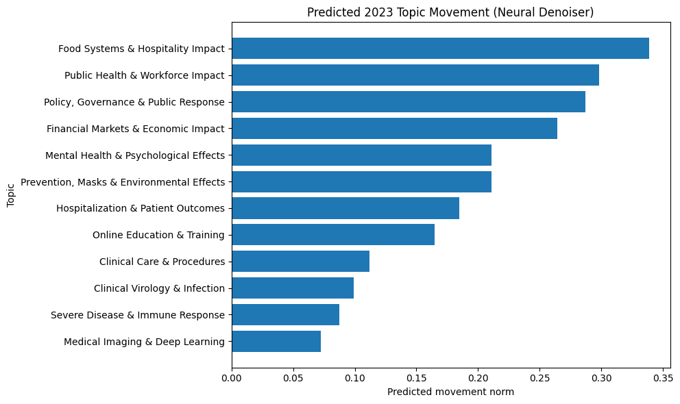
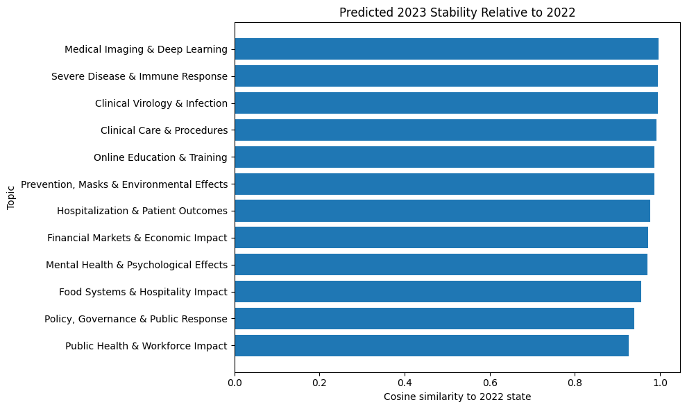
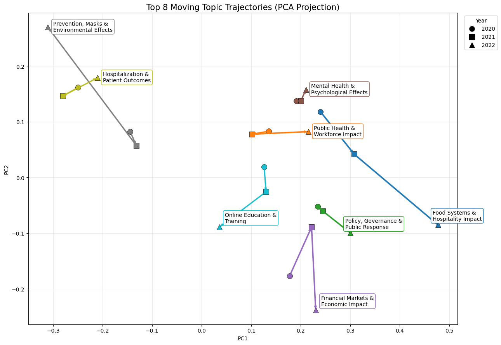
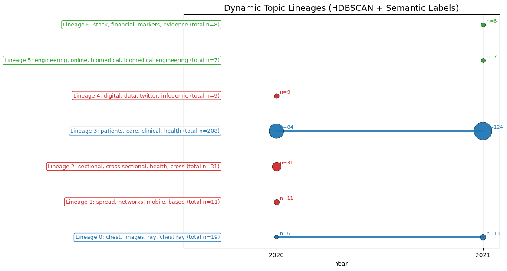

# Diffusion-Based Topic Evolution in Biomedical Literature

This project models how biomedical research topics evolve over time by combining topic discovery, clustering, and geometric trajectory modeling in embedding space. Rather than fixing a static set of topics, the workflow extracts topic representations from biomedical abstracts grouped by time period, aligns related topics across years, and analyzes their evolution using:

- geometric trajectories in embedding space 
- structural lineage tracking 
- diffusion-based modeling of topic dynamics

This enables analysis of the following:
- Which topics persist over the years? 
- Which topics emerge and which phase out?  
- How does the research landscape change over time?  
- How much do certain topics move over time? 

---

## Key Outputs

### Topic Movement Distribution


Distribution of topic movement magnitudes across time.

---

### Cosine Similarity Diagnostics


Measures how well topics align across adjacent years.

---

### Topic Trajectories (Top 8 Movers)


Tracks semantic drift of the most dynamic topics in embedding space.

Encodes:
- direction of movement  
- magnitude (line thickness)  
- temporal progression  

---

### Lineage Structure


Tracks how clusters evolve across time.

Encodes:
- persistence vs birth/death  
- document volume (node size)  
- semantic lineage labels  

---

## Core Idea

This project uses two complementary views of topic evolution:

### 1. Geometric Evolution (Embedding Space)
Topics are embedded in a continuous space and tracked over time using PCA.
> captures semantic drift

### 2. Structural Evolution (Lineages)
Clusters are tracked as discrete entities across time using HDBSCAN.
> captures birth, persistence, and disappearance

---

Together:

> Topic evolution = continuous semantic motion + discrete structural change

---

## Diffusion Modeling

A diffusion model is trained on topic embedding trajectories to learn the stochastic dynamics of topic evolution.

This enables:
- modeling uncertainty in topic movement  
- generating plausible future topic trajectories  
- capturing nonlinear evolution patterns beyond deterministic alignment  

Current implementation focuses on learning trajectory distributions; integration into forecasting and visualization is ongoing.

---

## Current Pipeline

1. collect biomedical abstracts with publication dates  
2. preprocess and store documents in SQLite  
3. compute document embeddings (sentence-transformers)  
4. cluster documents per year using HDBSCAN  
5. represent clusters via embedding centroids  
6. align clusters across years into trajectories  
7. compute topic movement metrics  
8. model trajectory evolution using diffusion models (PyTorch)  
9. visualize trajectories and lineage dynamics  

---

## User Guide

This project supports two ways to run:

### Full Pipeline

Runs the entire workflow from raw data → embeddings → clustering → trajectories → visualizations.

Step 1: Clone the repository

```text
git clone https://github.com/JonathanMa03/diffusion-topic-evolution.git
cd diffusion-topic-evolution
```

Step 2: Set up environment

```text
python -m venv .venv
source .venv/bin/activate      # Mac/Linux
.venv\Scripts\activate         # Windows
```

Step 3: Install dependencies

```text
pip install -r requirements.txt
python -m spacy download en_core_web_sm
```

Step 4: Run pipeline scripts

```text
python scripts/run_pipeline.py
```

This will prompt you for a beginning and end year, along with a query. Outputs will be in `runs/<run_name>/`

Step 5: Launch dashboard

```text
python dashboards/app.py
```
### Notebook Workflow

Run step-by-step using notebooks:

```text
jupyter lab
```

Recommended order:
	1.	01_data_ingestion.ipynb
	2.	02_embedding_pipeline.ipynb
	3.	03_topic_discovery.ipynb
	4.	04_topic_dynamics.ipynb
	5.	05_diffusion_topic_simulation.ipynb
	6.	06_diffusion_denoising_model.ipynb
	7.	07_bnp_dynamic_topics.ipynb
	8.	08_topic_visualization.ipynb

---

## Next Steps

- improve diffusion model calibration and training stability  
- Improve PCA visualization
- Improve lineage labeling, either by comparing to a preset or extrapolation
- handle multiple queries (ie search “AMD” and “compliment_proteins”) in the same article

---

## Tech Stack

- Python  
- Jupyter notebooks  
- SQLite  
- pandas / numpy  
- scikit-learn  
- sentence-transformers  
- matplotlib / plotly  
- PyTorch 
- Dash

---

## Repository Structure

```text
diffusion-topic-evaluation/
├── README.md
├── requirements.txt
├── LICENSE
├── dashboards/                # Interactive dashboard (Plotly/Dash app)
│   └── app.py
├── data/                      # Raw and intermediate data (ignored in git)
├── db/                        # SQLite database + schema
│   ├── app.db
│   └── schema.sql
├── displays/                  # Static display assets (used in README / docs)
├── logs/                      # Pipeline + experiment logs
├── notebooks/                 # Research + development workflow (step-by-step pipeline)
│   ├── 01_data_ingestion.ipynb
│   ├── 02_embedding_pipeline.ipynb
│   ├── 03_topic_discovery.ipynb
│   ├── 04_topic_dynamics.ipynb
│   ├── 05_diffusion_topic_simulation.ipynb
│   ├── 06_diffusion_denoising_model.ipynb
│   ├── 07_bnp_dynamic_topics.ipynb
│   ├── 08_topic_visualization.ipynb
│   └── 09_testing.ipynb
├── outputs/                   # Generated visualizations (used in analysis + README)
│   ├── cosine_sim_latest.png
│   ├── linneage.png
│   ├── movement_norm.png
│   ├── top8_pca.png
│   └── top8_umap.png
├── runs/                      # Experiment runs (each folder = full pipeline execution)
│   ├── 2018_2022_cancer_title_abstract/
│   ├── 2019_2023_general_title_abstract/
│   └── 2020_2022_broad_biomedical/
│   # Contains: embeddings, clusters, trajectories, metrics, etc.
├── scripts/                   # Pipeline execution scripts (entry points)
├── src/                       # Core reusable code (modular pipeline logic)
│   └── pipeline/              # Topic modeling, alignment, diffusion modules
```

---

## Key Insights from 2020 COVID Data

The early COVID-19 literature exhibits a highly concentrated thematic structure, with a small number of dominant clusters accounting for a large share of publications. Persistent lineages such as Clinical Care & Patients and Public Health & Workforce Impact remain stable across multiple years and contain the highest document volumes.

In contrast, smaller clusters display clear birth-and-death dynamics. Topics such as Digital Data & Infodemic Analysis and Network Spread & Mobility Modeling emerge briefly but do not persist, indicating fragmentation or exploratory research directions.

PCA trajectory analysis reveals substantial heterogeneity in semantic drift. Some topics exhibit large movement norms—indicating evolving focus—while others remain highly stable with near-linear trajectories.

Importantly:

> structural persistence does not imply semantic stability

A lineage may persist while its underlying semantics continue to shift.

The diffusion model further reinforces that topic evolution is inherently stochastic, capturing multiple plausible future trajectories rather than a single deterministic path.